# Consumer Trust in Online Reviews

## Overview

This project was developed as part of the **Applied Statistics** course at Air University.

The study analyzes how online reviews influence consumer purchasing decisions using statistical techniques in **IBM SPSS Statistics**. Data was collected through Google Forms from Pakistani online shoppers and analyzed using descriptive statistics and multiple non-parametric hypothesis tests.

---

## Objectives

- Analyze consumer trust in online reviews.
- Study the impact of negative reviews on purchase decisions.
- Examine willingness to pay more for highly-rated products.
- Compare trust levels across different demographic groups.
- Investigate review-checking behavior among consumers.

---

## Dataset

The survey data was collected using **Google Forms** from **81 respondents**.

The dataset includes information on:

- Age Group
- Education Level
- Preferred Shopping Platform
- Shopping Frequency
- Trust in Online Reviews
- Impact of Negative Reviews
- Importance of Review Count
- Trust in Verified Purchase Reviews
- Preference for Photo/Video Reviews
- Review Checking Behavior
- Product Return History
- Purchase Decision Behavior

---

## Tools Used

- IBM SPSS Statistics
- Microsoft Excel
- Google Forms

---

## Statistical Techniques

The following analyses were performed:

- Descriptive Statistics
- Frequency Analysis
- Bar Charts
- Shapiro-Wilk Normality Test
- Wilcoxon Signed-Rank Test
- Mann-Whitney U Test
- Kruskal-Wallis H Test
- Chi-Square Test of Independence
- Spearman Rank Correlation

---

## Key Findings

- Negative reviews have a significantly stronger influence on purchasing decisions than general trust in reviews.
- Younger consumers are more likely to check online reviews before purchasing.
- Consumers who frequently check reviews tend to trust online reviews more.
- No significant difference in trust levels was found across different age groups or return behavior.

---

## Project Structure

```
consumer-trust-online-reviews/
│
├── dataset/
│   └── consumer_trust_dataset.xlsx
│
├── spss/
│   ├── Consumer_Trust_Online_Reviews.sav
│   └── Consumer_Trust_Online_Reviews.spv
│
├── screenshots/
│   ├── descriptives/
│   ├── bar-graphs/
│   ├── normality-test/
│   └── non-parametric-tests/
│
├── presentation/
│   └── Consumer_Trust_Online_Reviews.pptx
│
├── README.md
├── LICENSE
└── .gitignore
```

---

# Screenshots

## Descriptive Statistics

| Screenshot |
|------------|
| 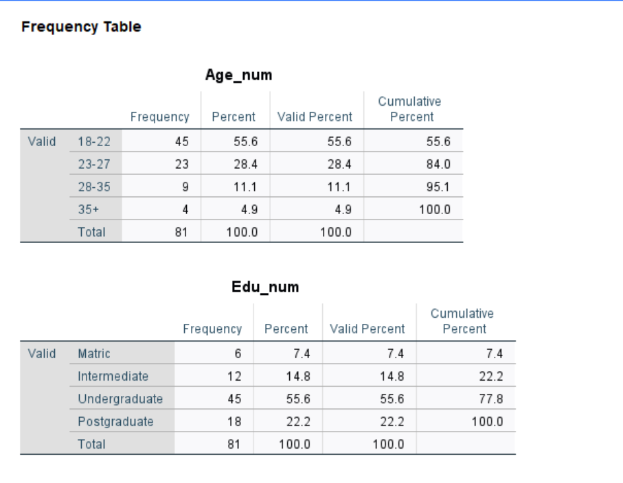 |
| 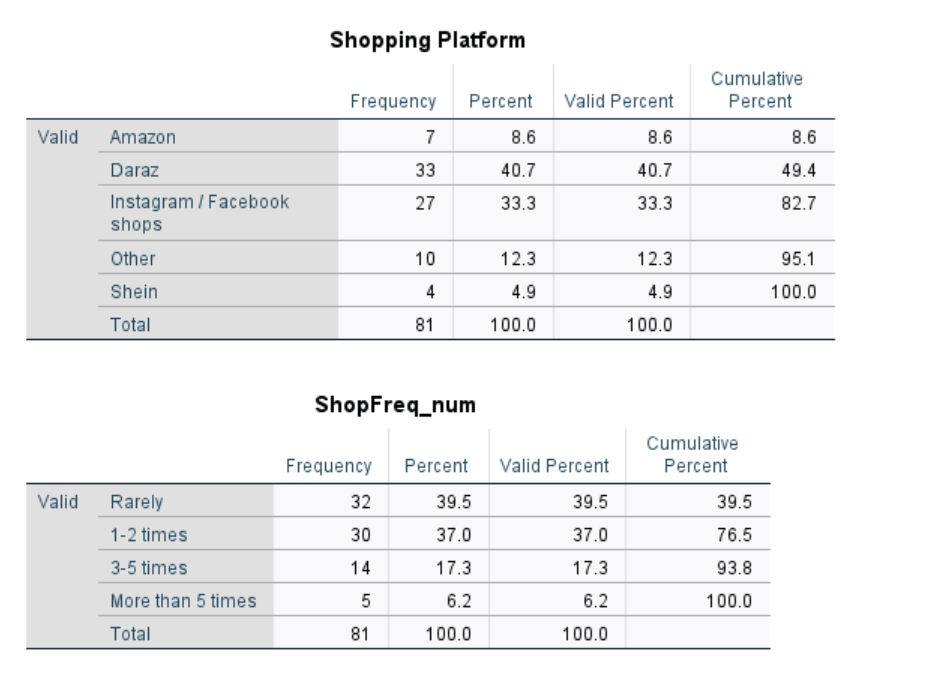 |
| 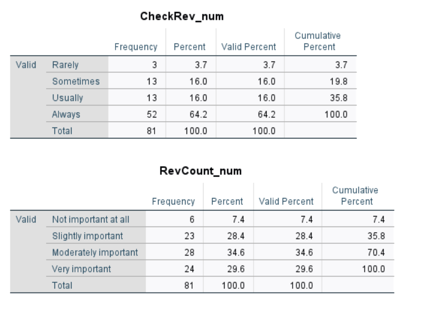 |
| 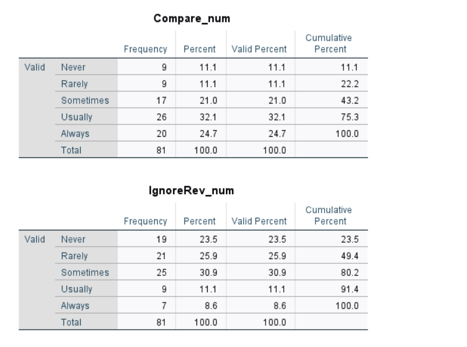 |
| 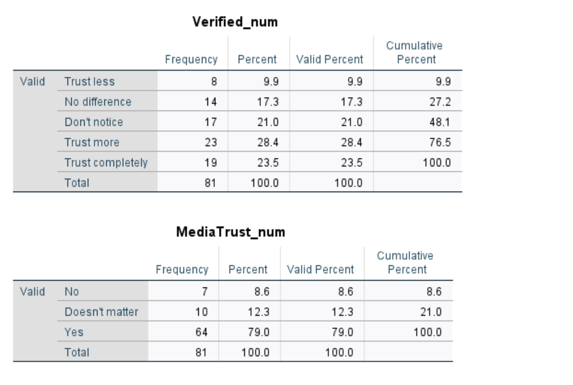 |
| 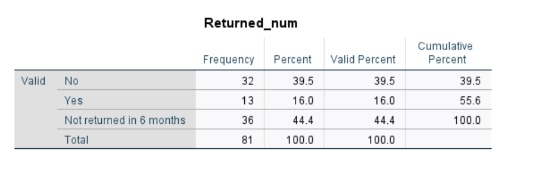 |
| 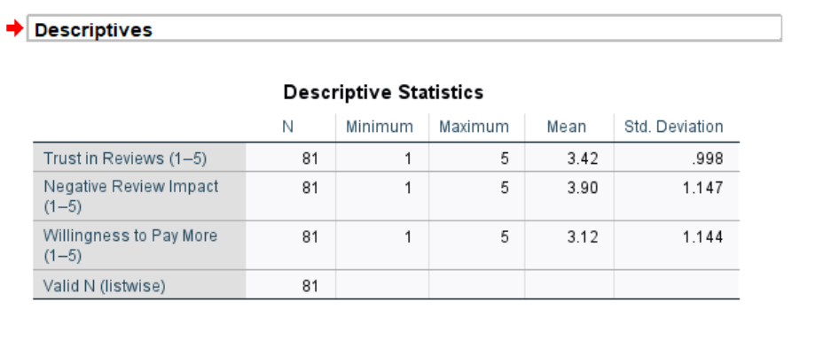 |

---

## Bar Graphs

### Age Distribution


### Shopping Platform Frequency

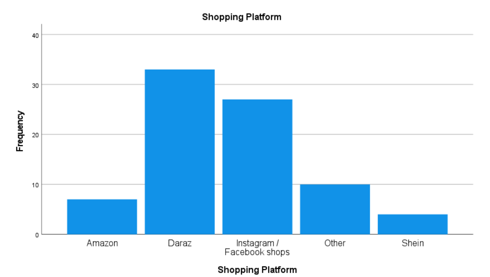

---

## Normality Test

### Shapiro-Wilk Test

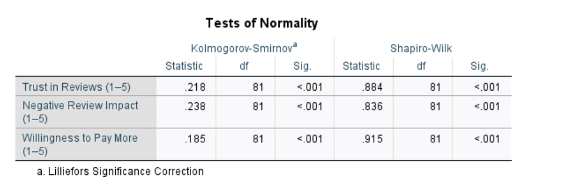

## Non-Parametric Tests

### Wilcoxon Signed-Rank Test

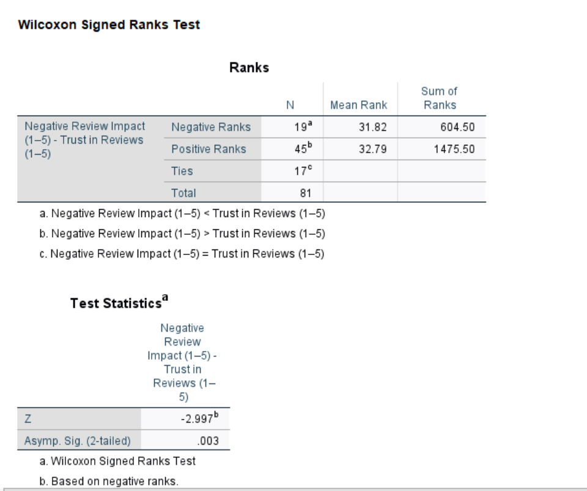

### Mann-Whitney U Test

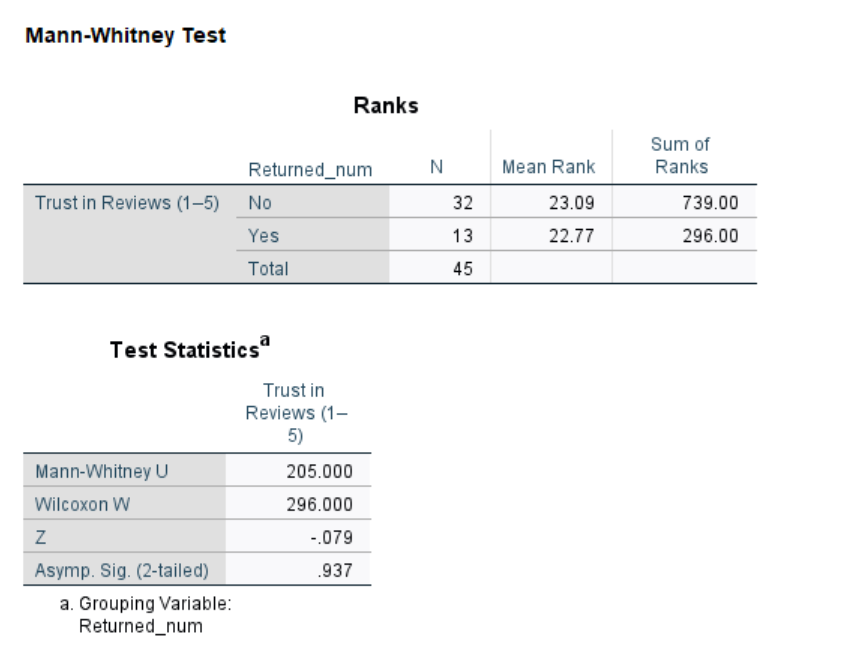

### Kruskal-Wallis H Test

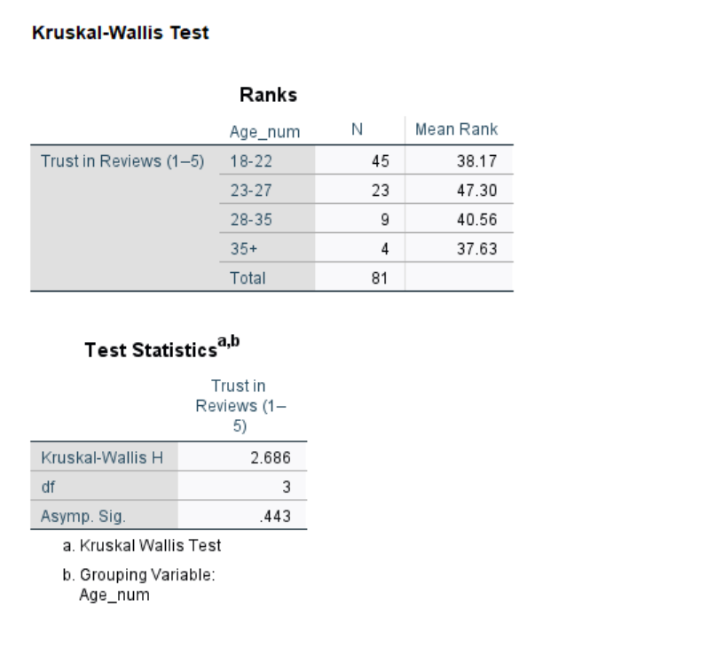

### Spearman Correlation

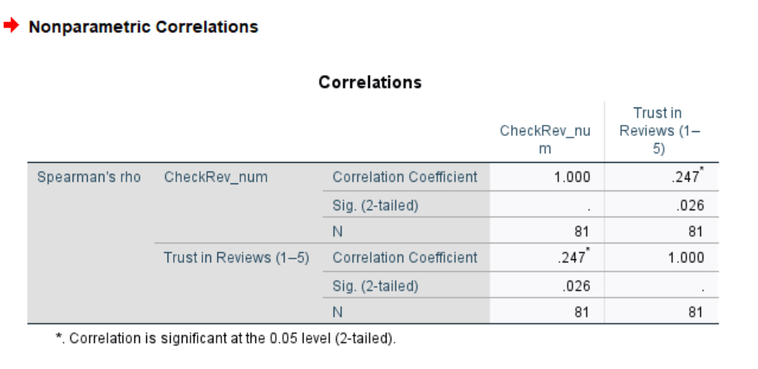

### Chi-Square Test of Independence

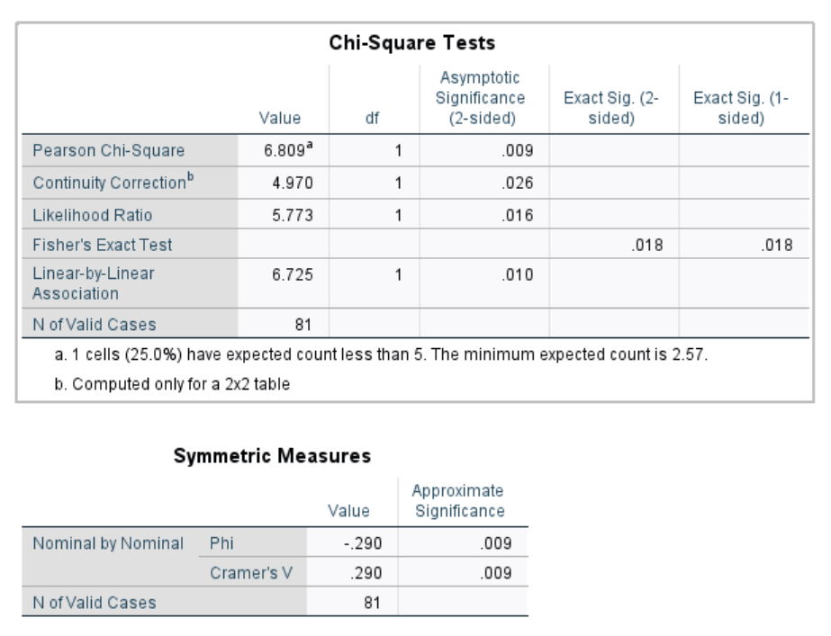